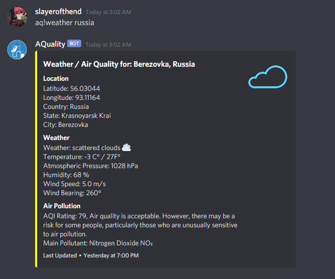
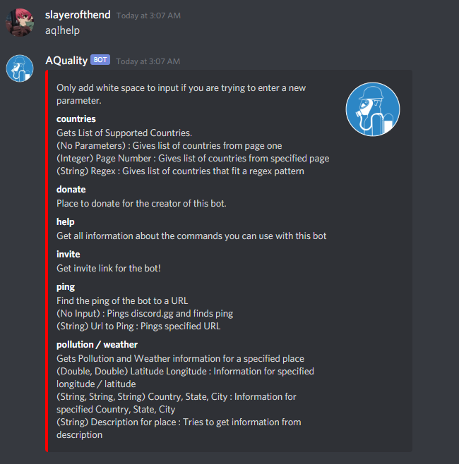

# AQualityBot
A discord bot to help show the air quality and weather, using the AirVisual API to get data. Also uses a little bit of 
google's geocode api to get information about different locations. You can invite the bot 
[here](https://discord.com/api/oauth2/authorize?client_id=449832399833137153&permissions=0&scope=bot).

# Motivation
I wanted to learn a little bit more about how to use an API, and also wanted to try to learn how to use someone elses libraries 
for a change. I have also always wanted to make a discord bot but lacked the technical knowledge and / or motivation to start until now. 

# Screenshots

# Tech/Framework Used
Main framework is [Discord4J](https://github.com/Discord4J/Discord4J) api for talking with discord. I also 
heavily used the [Jackson](https://github.com/FasterXML/jackson) library for JSON parsing 

# Code Example 
The main code base is split into 3 parts, the API connection part (com.AQuality.api), 
the part where the logic for the commands are (com.AQuality.commands), and 
the core framework of the code that helps connect discord4J 
to the overall code base and other important / misc classes (com.AQuality.core)

# License 

MIT License

Copyright (c) [2020] [slayerofthend]

Permission is hereby granted, free of charge, to any person obtaining a copy
of this software and associated documentation files (the "Software"), to deal
in the Software without restriction, including without limitation the rights
to use, copy, modify, merge, publish, distribute, sublicense, and/or sell
copies of the Software, and to permit persons to whom the Software is
furnished to do so, subject to the following conditions:

The above copyright notice and this permission notice shall be included in all
copies or substantial portions of the Software.

THE SOFTWARE IS PROVIDED "AS IS", WITHOUT WARRANTY OF ANY KIND, EXPRESS OR
IMPLIED, INCLUDING BUT NOT LIMITED TO THE WARRANTIES OF MERCHANTABILITY,
FITNESS FOR A PARTICULAR PURPOSE AND NONINFRINGEMENT. IN NO EVENT SHALL THE
AUTHORS OR COPYRIGHT HOLDERS BE LIABLE FOR ANY CLAIM, DAMAGES OR OTHER
LIABILITY, WHETHER IN AN ACTION OF CONTRACT, TORT OR OTHERWISE, ARISING FROM,
OUT OF OR IN CONNECTION WITH THE SOFTWARE OR THE USE OR OTHER DEALINGS IN THE
SOFTWARE.

